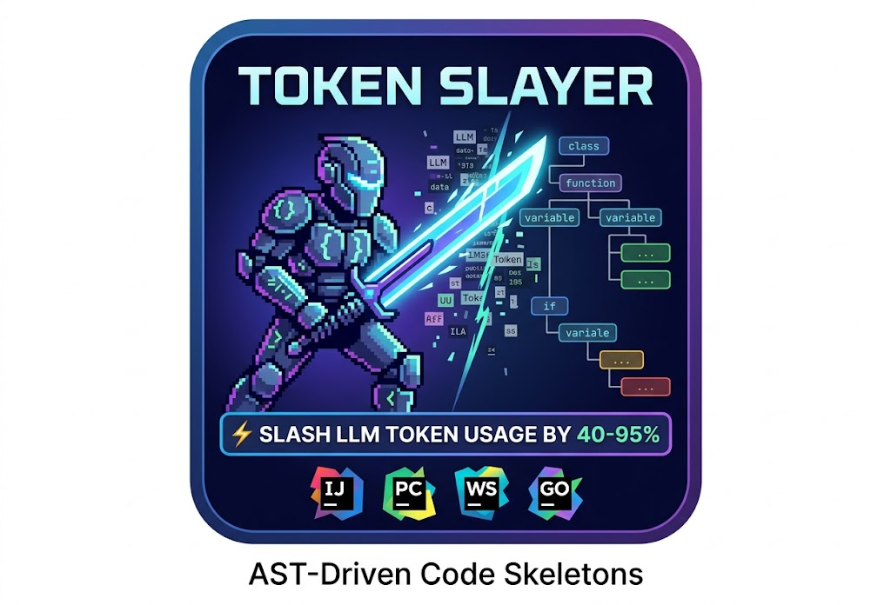

# TokenSlayer for JetBrains

<p align="center">
  
</p>

> ⚡ Slash LLM token usage by **40–95%** with AST-driven code skeletons — for IntelliJ IDEA, PyCharm, WebStorm, GoLand, Rider, and more.

**A JetBrains port of the original [TokenSlayer VS Code Extension](https://github.com/ajvikram/TokenSlayer) created by [Ajay Vikram](https://github.com/ajvikram).**

[](https://github.com/donco-labs/token-slayer-jb/actions/workflows/ci.yml)

TokenSlayer eliminates the "orientation tax" AI coding assistants pay when reading raw source files. Instead of sending 1,200 lines of code (~5,000 tokens) to GitHub Copilot, it generates a compact 8-line structural skeleton (~200 tokens) — a **96% token reduction**.

```
Without TokenSlayer:  1,200 lines of raw code → 5,000 tokens consumed
With TokenSlayer:     8-line structural skeleton → 200 tokens consumed (96% reduction)
```

## 🔧 GitHub Copilot Integration

TokenSlayer runs an embedded **MCP server** on a stable local port and exposes the
`tokenslayer_structural_summary` tool. Once registered, Copilot can invoke it autonomously —
the JetBrains equivalent of VS Code's `#tokenslayer-structural-summary`.

```
User:  How is authentication structured in this codebase?
Copilot → calls tokenslayer_structural_summary
       → receives compact skeleton
       → answers using 200 tokens instead of 5,000
```

**Registering the server** (one-time): GitHub Copilot for JetBrains discovers MCP servers from
its global config at `~/.config/github-copilot/intellij/mcp.json` — it does **not** read a
per-project file. To register TokenSlayer:

1. Open **Settings → Tools → TokenSlayer → GitHub Copilot (MCP)**.
2. Click **Copy Copilot mcp.json snippet** (or copy it from the shown Server URL).
3. Paste it into `~/.config/github-copilot/intellij/mcp.json` (merge with any existing `servers`).
4. Reload MCP servers in Copilot.

The server port is configurable and stable across restarts, so the registration keeps working.
Prefer not to wire up Copilot? The **Copy Skeleton Summary** action pastes a skeleton straight
into Copilot Chat.

## 📊 Features

- **🔧 Copilot MCP Tool** — `tokenslayer_structural_summary` auto-invoked by Copilot Chat
- **📊 Live Dashboard** — token savings counter, language breakdown, top savers, cache stats
- **⚡ Inline Inlay Hints** — `⚡ ~119 lines → ~14 lines skeleton` above each class/function
- **📂 Project Tree Badges** — color-coded reduction percentages on file nodes
- **🛡️ Secrets Detection** — auto-excludes files with AWS keys, GitHub tokens, passwords, etc.
- **👁️ Skeleton Preview** — side-by-side diff view of original vs skeleton
- **📋 Export Report** — Markdown savings report for the workspace
- **🌐 Languages** — Java, Kotlin, Python, JS, TypeScript, Go, Rust

## ⌨️ Commands (Tools menu / right-click)

| Command | Description |
|---------|-------------|
| Analyze Workspace | Scan all supported files and build skeleton cache |
| Analyze Current File | Analyze the active editor file |
| Preview Skeleton | Side-by-side diff: original vs skeleton |
| Copy Skeleton Summary | Copy skeleton to clipboard for Copilot Chat |
| Export Savings Report | Write `tokenslayer-report.md` to project root |
| Clear Cache | Wipe all cached skeletons |

## ⚙️ Settings

**Settings → Tools → TokenSlayer**

| Setting | Default | Description |
|---------|---------|-------------|
| Max file size (KB) | 500 | Files larger than this are skipped |
| Cache max entries | 500 | LRU cache size |
| Verbosity | standard | `minimal` / `standard` / `detailed` |
| Ignored paths | node_modules, build… | Comma-separated path fragments to skip |
| Enable inlay hints | true | ⚡ hints above classes/functions |
| Enable file decorations | true | Reduction badges on Project tree |

## 🏗️ Architecture

```
┌────────────────────────────────────────────────────┐
│                  IntelliJ Plugin Host               │
├────────────────────────────────────────────────────┤
│                                                    │
│  ┌──────────────┐  ┌──────────────┐  ┌──────────┐ │
│  │  MCP Server  │  │  Dashboard   │  │  Inlay   │ │
│  │  (Copilot)   │  │  (Swing TW)  │  │  Hints   │ │
│  └──────┬───────┘  └──────┬───────┘  └────┬─────┘ │
│         │                 │               │        │
│  ┌──────▼─────────────────▼───────────────▼──────┐ │
│  │              TokenSlayerService                │ │
│  ├────────────────────────────────────────────────┤ │
│  │  ┌─────────────┐  ┌──────────────┐  ┌───────┐ │ │
│  │  │  PSI Symbol │  │   Skeleton   │  │Secrets│ │ │
│  │  │  Extractor  │  │   Builder    │  │Detect │ │ │
│  │  └──────┬──────┘  └──────┬───────┘  └───┬───┘ │ │
│  │         │                │              │      │ │
│  │  ┌──────▼────────────────▼──────────────▼────┐ │ │
│  │  │              Compactors                   │ │ │
│  │  │  Java │ Kotlin │ Python │ JS/TS │ Go │ Rust│ │ │
│  │  └───────────────────────┬───────────────────┘ │ │
│  │                          │                      │ │
│  │  ┌───────────────────────▼───────────────────┐  │ │
│  │  │       LRU Cache (PersistentStateComponent) │  │ │
│  │  └───────────────────────────────────────────┘  │ │
│  └────────────────────────────────────────────────┘ │
│                                                    │
│  ┌─────────────┐  ┌──────────────┐  ┌──────────┐  │
│  │  File Tree  │  │   Skeleton   │  │  Status  │  │
│  │  Decorator  │  │   Preview    │  │   Bar    │  │
│  └─────────────┘  └──────────────┘  └──────────┘  │
└────────────────────────────────────────────────────┘
```

## 🛠️ Development

### Requirements
- JDK 17+
- IntelliJ IDEA (for plugin development)

### Build & Run

```bash
# Clone
git clone https://github.com/donco-labs/token-slayer-jb.git
cd token-slayer-jb

# Run in dev IDE (launches IntelliJ with plugin loaded)
./gradlew runIde

# Run tests
./gradlew test

# Build distributable ZIP
./gradlew buildPlugin

# Verify plugin compatibility
./gradlew verifyPlugin
```

### Install from ZIP
1. Build: `./gradlew buildPlugin`
2. In JetBrains IDE: **Settings → Plugins → ⚙️ → Install Plugin from Disk…**
3. Select `build/distributions/token-slayer-jb-*.zip`
4. Restart IDE

### Release

Releases are **tag-driven**: the version stamped into `plugin.xml` and the ZIP comes from the
pushed git tag (`v0.3.0` → `0.3.0`), not from `gradle.properties`. The "What's New" notes are
rendered from [`CHANGELOG.md`](CHANGELOG.md).

Recommended flow to cut version `X.Y.Z`:

```bash
# 1. Move the [Unreleased] notes into a new [X.Y.Z] section (and open a fresh [Unreleased]).
#    Either edit CHANGELOG.md by hand, or let the changelog plugin do it:
./gradlew patchChangelog -PpluginVersion=X.Y.Z

# 2. Keep gradle.properties' pluginVersion in sync for local builds, then commit.
#    (Set pluginVersion=X.Y.Z in gradle.properties.)
git add CHANGELOG.md gradle.properties
git commit -m "Release X.Y.Z"

# 3. Tag and push — GitHub Actions then validates the tag, runs CI + Plugin Verifier,
#    builds the versioned ZIP, and creates a GitHub Release with it attached.
git tag vX.Y.Z
git push origin main --tags
```

If you tag without a matching `[X.Y.Z]` section, the release notes fall back to the
`[Unreleased]` section. Pre-release suffixes work too (`vX.Y.Z-beta.1` → the `beta` channel).

## 📝 License

MIT — JetBrains port of [TokenSlayer](https://github.com/ajvikram/TokenSlayer) by Ajay Vikram
