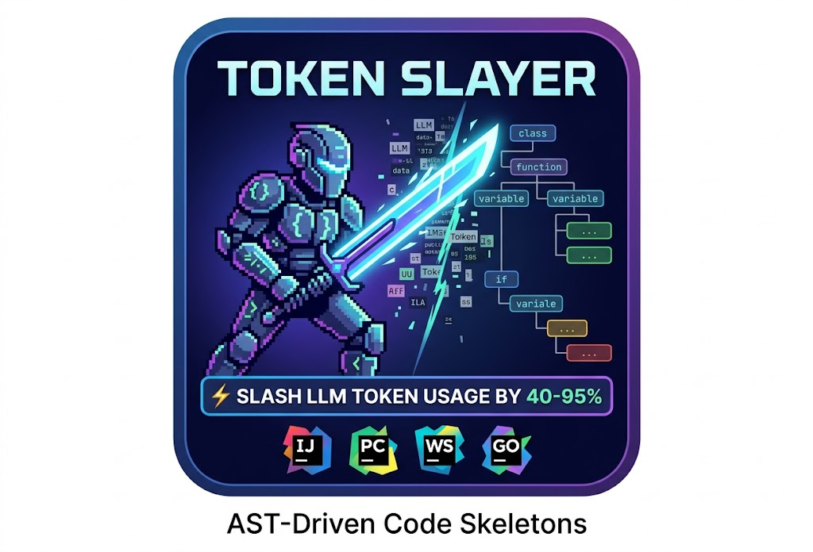

# TokenSlayer for JetBrains

<p align="center">
  
</p>

> ⚡ Slash LLM token usage by **40–95%** with AST-driven code skeletons — for IntelliJ IDEA, PyCharm, WebStorm, GoLand, Rider, and more.

**A JetBrains port of the original [TokenSlayer VS Code Extension](https://github.com/ajvikram/TokenSlayer) created by [Ajay Vikram](https://github.com/ajvikram).**

[](https://github.com/donco-labs/token-slayer-jb/actions/workflows/ci.yml)

TokenSlayer eliminates the "orientation tax" AI coding assistants pay when reading raw source files. Instead of sending 1,200 lines of code (~5,000 tokens) to GitHub Copilot, it generates a compact 8-line structural skeleton (~200 tokens) — a **96% token reduction**.

```
Without TokenSlayer:  1,200 lines of raw code → 5,000 tokens consumed
With TokenSlayer:     8-line structural skeleton → 200 tokens consumed (96% reduction)
```

## 🔧 GitHub Copilot Integration

TokenSlayer runs an embedded **MCP server** on a stable local port and exposes four tools:

| Tool | Purpose |
|------|---------|
| `tokenslayer_find` | Searches for a class, function, or symbol by name across the **whole project** — the tool an assistant should reach for instead of grep/find-in-files |
| `tokenslayer_structural_summary` | Compact skeleton of **one** file — what exists, without the bodies. Every signature is tagged with its own `:line` (or `:line-range`), citable directly in `tokenslayer_expand` |
| `tokenslayer_expand` | The real source of **one** symbol, so the assistant can drill in without re-reading the whole file |
| `tokenslayer_references` | Every usage of **one** symbol across the whole project — "who calls this", backed by the IDE's own find-usages index rather than a text match |

```
User:  How is authentication structured in this codebase?
Copilot → calls tokenslayer_find(query: "auth")
       → gets back Auth.kt:12 — class AuthService, TokenValidator.kt:8 — fun validateToken(...), …
       → calls tokenslayer_structural_summary on the file that looks relevant
       → receives a compact, line-tagged skeleton
       → answers using a few hundred tokens instead of thousands — no grep involved

User:  Now show me how validateToken actually works.
Copilot → calls tokenslayer_expand(symbol: "validateToken", filePath: ".../TokenValidator.kt")
       → receives just that function
       → the skeleton's saving survives instead of being undone by a full-file read

User:  If I change validateToken's signature, what breaks?
Copilot → calls tokenslayer_references(symbol: "validateToken", filePath: ".../TokenValidator.kt")
       → gets back every call site as file:line — enclosing signature
       → answers without grepping the name and guessing which hits are real calls

User:  I have a Kubernetes manifest bundle — what's in it?
Copilot → calls tokenslayer_structural_summary(filePath: ".../deploy.yaml")
       → receives one line per resource: [0] Deployment.api-server, [1] Service.api-server, …
       → calls tokenslayer_expand(symbol: "Deployment.api-server") for the one that matters
       → receives just that resource's full YAML, not the whole multi-hundred-line bundle
```

### YAML support

`tokenslayer_structural_summary` and `tokenslayer_expand` also understand YAML — the compaction
just works differently, because a config value **is** the content (unlike code, where a signature
already conveys the meaning and the body can be dropped). For a `---`-separated manifest bundle
(the common Kubernetes shape), the skeleton collapses to one line per resource, addressable by
`Kind.name`. Within one document: a list of many same-shaped map items (e.g. a long `env:` list)
collapses to its first item plus a count, a long scalar (a certificate, an inline script, base64
data) is elided to its length, and deep nesting collapses past a fixed depth. `tokenslayer_find`
and `tokenslayer_references` remain code-only — "where is this defined" and "who calls this" have
no clean analog for an arbitrary config key.

### Registering the server (one-time)

GitHub Copilot for JetBrains discovers MCP servers from its **global** config at
`~/.config/github-copilot/intellij/mcp.json` — it does **not** read a per-project file.

**Step 1 — get your Server URL.** Open **Settings → Tools → TokenSlayer → GitHub Copilot (MCP)**
and note the **Server URL**. It looks like `http://localhost:8763/mcp`.

> ⚠️ Use the port shown there, not necessarily 8763. The server prefers 8763 but falls back to an
> ephemeral port if that one is taken, and a config pointing at a dead port fails **silently** —
> no error, the tools simply never get called.

**Step 2 — add the entry to `mcp.json`.**

```bash
mkdir -p ~/.config/github-copilot/intellij
open -e ~/.config/github-copilot/intellij/mcp.json   # or use any editor
```

*If the file is new or empty*, this is the whole thing:

```json
{
  "servers": {
    "tokenslayer": {
      "type": "http",
      "url": "http://localhost:8763/mcp"
    }
  }
}
```

*If you already have MCP servers*, *merge* — add `tokenslayer` as a sibling. *Do not paste the
block above over the file; that deletes your other servers.* Going from this:

```json
{
  "servers": {
    "github": { "type": "http", "url": "https://api.githubcopilot.com/mcp/" }
  }
}
```

to this:

```json
{
  "servers": {
    "github": { "type": "http", "url": "https://api.githubcopilot.com/mcp/" },
    "tokenslayer": { "type": "http", "url": "http://localhost:8763/mcp" }
  }
}
```

> If your existing file uses `"mcpServers"` as the top-level key rather than `"servers"`, add
> `tokenslayer` under that key instead — match whatever is already there. Mind the comma between
> entries: invalid JSON makes Copilot ignore the file entirely.

**Step 3 — reload.** Click the **GitHub Copilot** icon → **Edit settings** → **MCP Servers**, and
reload. TokenSlayer should now appear in the server list with its two tools.

**Step 4 — use agent mode.** Ordinary Copilot Chat does **not** invoke MCP tools. A perfectly
registered server will never be called from plain chat, and the dashboard will keep reading
`Served 0`. Switch Copilot to agent mode, then ask something about your code.

Prefer not to wire up Copilot? The **Copy Skeleton Summary** action pastes a skeleton straight
into Copilot Chat.

### Troubleshooting: dashboard shows `Served 0`

The dashboard's headline is *realized* savings — tokens in content actually delivered to an
assistant. `Served 0` alongside a healthy **Potential** figure means analysis is working fine and
Copilot has simply never called the tools. Work through it in this order:

1. **Is the server up?** With the IDE running:

   ```bash
   curl -s http://localhost:8763/health
   curl -s -X POST http://localhost:8763/mcp -H 'Content-Type: application/json' \
        -d '{"jsonrpc":"2.0","id":1,"method":"tools/list"}'
   ```

   That should list all four tools. If so, the plugin side is fine and the problem is Copilot-side.

2. **Is `tokenslayer` actually in `mcp.json`?** Being registered for *other* MCP servers doesn't
   register this one.
3. **Does the port in `mcp.json` match the one in Settings?** See the warning above.
4. **Were you in agent mode?** This is the most common cause of a perfectly configured server
   never being invoked.

## 📊 Features

- **🔧 Copilot MCP Tools** — `tokenslayer_find`, `tokenslayer_structural_summary`, `tokenslayer_expand`, `tokenslayer_references`, auto-invoked by Copilot in agent mode
- **📊 Live Dashboard** — token savings counter, language breakdown, top savers, cache stats
- **⚡ Inline Inlay Hints** — `⚡ ~119 lines → ~14 lines skeleton` above each class/function
- **📂 Project Tree Badges** — color-coded reduction percentages on file nodes
- **🛡️ Secrets Detection** — auto-excludes files with AWS keys, GitHub tokens, passwords, etc.
- **👁️ Skeleton Preview** — side-by-side diff view of original vs skeleton
- **📋 Export Report** — Markdown savings report for the workspace
- **🌐 Languages** — Java, Kotlin, Python, JS, TypeScript, Go, Rust
- **📄 Data formats** — YAML (Kubernetes manifests, GitHub Actions, Helm values, docker-compose, …)

## ⌨️ Commands (Tools menu / right-click)

| Command | Description |
|---------|-------------|
| Analyze Workspace | Scan all supported files and build skeleton cache |
| Analyze Current File | Analyze the active editor file |
| Preview Skeleton | Side-by-side diff: original vs skeleton |
| Copy Skeleton Summary | Copy skeleton to clipboard for Copilot Chat |
| Export Savings Report | Write `tokenslayer-report.md` to project root |
| Clear Cache | Wipe all cached skeletons |

## ⚙️ Settings

**Settings → Tools → TokenSlayer**

| Setting | Default | Description |
|---------|---------|-------------|
| Max file size (KB) | 500 | Files larger than this are skipped |
| Cache max entries | 500 | LRU cache size |
| Verbosity | standard | `minimal` / `standard` / `detailed` |
| Ignored paths | node_modules, build… | Comma-separated path fragments to skip |
| Enable inlay hints | true | ⚡ hints above classes/functions |
| Enable file decorations | true | Reduction badges on Project tree |

## 🏗️ Architecture

```
┌────────────────────────────────────────────────────┐
│                  IntelliJ Plugin Host               │
├────────────────────────────────────────────────────┤
│                                                    │
│  ┌──────────────┐  ┌──────────────┐  ┌──────────┐ │
│  │  MCP Server  │  │  Dashboard   │  │  Inlay   │ │
│  │  (Copilot)   │  │  (Swing TW)  │  │  Hints   │ │
│  └──────┬───────┘  └──────┬───────┘  └────┬─────┘ │
│         │                 │               │        │
│  ┌──────▼─────────────────▼───────────────▼──────┐ │
│  │              TokenSlayerService                │ │
│  ├────────────────────────────────────────────────┤ │
│  │  ┌─────────────┐  ┌──────────────┐  ┌───────┐ │ │
│  │  │  PSI Symbol │  │   Skeleton   │  │Secrets│ │ │
│  │  │  Extractor  │  │   Builder    │  │Detect │ │ │
│  │  └──────┬──────┘  └──────┬───────┘  └───┬───┘ │ │
│  │         │                │              │      │ │
│  │  ┌──────▼────────────────▼──────────────▼────┐ │ │
│  │  │              Compactors                   │ │ │
│  │  │  Java │ Kotlin │ Python │ JS/TS │ Go │ Rust│ │ │
│  │  └───────────────────────┬───────────────────┘ │ │
│  │                          │                      │ │
│  │  ┌───────────────────────▼───────────────────┐  │ │
│  │  │       LRU Cache (PersistentStateComponent) │  │ │
│  │  └───────────────────────────────────────────┘  │ │
│  └────────────────────────────────────────────────┘ │
│                                                    │
│  ┌─────────────┐  ┌──────────────┐  ┌──────────┐  │
│  │  File Tree  │  │   Skeleton   │  │  Status  │  │
│  │  Decorator  │  │   Preview    │  │   Bar    │  │
│  └─────────────┘  └──────────────┘  └──────────┘  │
└────────────────────────────────────────────────────┘
```

## 🛠️ Development

### Requirements
- JDK 17+
- IntelliJ IDEA (for plugin development)

### Build & Run

```bash
# Clone
git clone https://github.com/donco-labs/token-slayer-jb.git
cd token-slayer-jb

# Run in dev IDE (launches IntelliJ with plugin loaded)
./gradlew runIde

# Run tests
./gradlew test

# Build distributable ZIP
./gradlew buildPlugin

# Verify plugin compatibility
./gradlew verifyPlugin
```

### Install from ZIP
1. Build: `./gradlew buildPlugin`
2. In JetBrains IDE: **Settings → Plugins → ⚙️ → Install Plugin from Disk…**
3. Select `build/distributions/token-slayer-jb-*.zip`
4. Restart IDE

### Release

Releases are **tag-driven**: the version stamped into `plugin.xml` and the ZIP comes from the
pushed git tag (`v0.3.0` → `0.3.0`), not from `gradle.properties`. The "What's New" notes are
rendered from [`CHANGELOG.md`](CHANGELOG.md).

Recommended flow to cut version `X.Y.Z`:

```bash
# 1. Move the [Unreleased] notes into a new [X.Y.Z] section (and open a fresh [Unreleased]).
#    Either edit CHANGELOG.md by hand, or let the changelog plugin do it:
./gradlew patchChangelog -PpluginVersion=X.Y.Z

# 2. Keep gradle.properties' pluginVersion in sync for local builds, then commit.
#    (Set pluginVersion=X.Y.Z in gradle.properties.)
git add CHANGELOG.md gradle.properties
git commit -m "Release X.Y.Z"

# 3. Tag and push — GitHub Actions then validates the tag, runs CI + Plugin Verifier,
#    builds the versioned ZIP, and creates a GitHub Release with it attached.
git tag vX.Y.Z
git push origin main --tags
```

If you tag without a matching `[X.Y.Z]` section, the release notes fall back to the
`[Unreleased]` section. Pre-release suffixes work too (`vX.Y.Z-beta.1` → the `beta` channel).

## 📝 License

MIT — JetBrains port of [TokenSlayer](https://github.com/ajvikram/TokenSlayer) by Ajay Vikram
